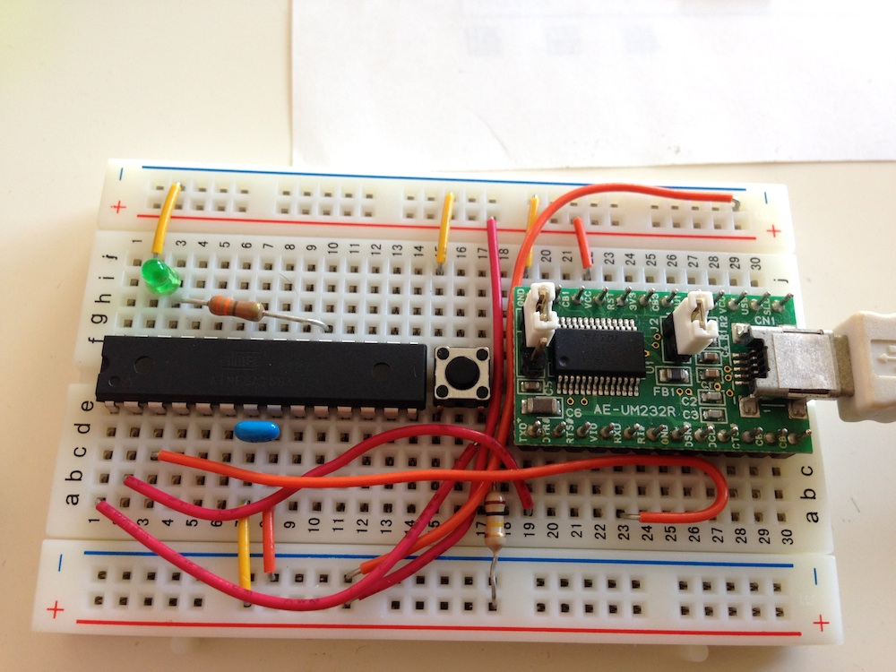
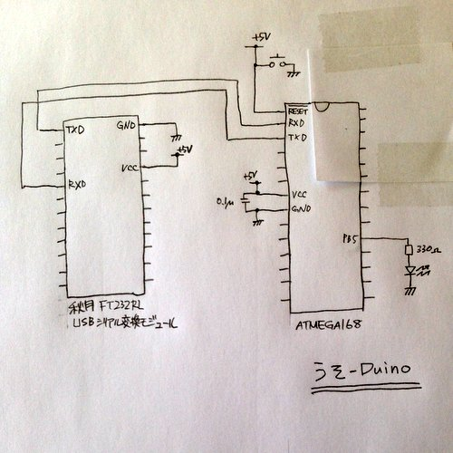

Uso-duino - a tiny Arduino clone
===============

## Features

- device: ATMEGA168
- internal osc 8MHz (no xtal / ceramic resonator)
- modified bootloader

## Fuses

    low:     0xf8
    high:    0xdd
    extended:0xe2

## Bootloader

write `bootloaders/atmega/ATmegaBOOT_168_diecimila_8mhz.hex` to flash using isp-programmer or avr-dragon.

## Board setting

open `Arduino.app/Contents/Resources/Java/hardware/arduino/boards.txt`, then add following lines

    ##############################################################
    diecimila.name=Arduino Diecimila, Duemilanove, or Nano w/ ATmega168 8MHz
    
    diecimila.upload.protocol=stk500
    diecimila.upload.maximum_size=14336
    diecimila.upload.speed=19200
    
    diecimila.bootloader.low_fuses=0xf8
    diecimila.bootloader.high_fuses=0xdd
    diecimila.bootloader.extended_fuses=0xe2
    diecimila.bootloader.path=atmega
    diecimila.bootloader.file=ATmegaBOOT_168_diecimila_8mhz.hex
    diecimila.bootloader.unlock_bits=0x3F
    diecimila.bootloader.lock_bits=0x0F
    
    diecimila.build.mcu=atmega168
    diecimila.build.f_cpu=8000000L
    diecimila.build.core=arduino

## IDE setting

You can download Arduino IDE from [here](http://arduino.cc/en/Guide/HomePage).

- Tools / board: Arduino Diecimila, Duemilanove, or Nano w/ ATmega168 8MHz
- Tools / Serial Port: /dev/tty.usbserial-XXX
- Tools / Programmer: AVRISP mkII

## How to upload sketch

Sample sketch is [here](https://github.com/gnrr/uso-duino/blob/master/doc/sample_led0.ino).

1. Press 'RESET' SW on うそ-duino
1. Push 'UPLOAD' button on IDE
1. Release 'RESET' SW on うそ-duino
1. New sketch is started running when you get message 'Done uploading.' on IDE

## Thanks to

- http://ikuyama.net/ryo/namalog3/2011/10/05/arduino-8mh/
